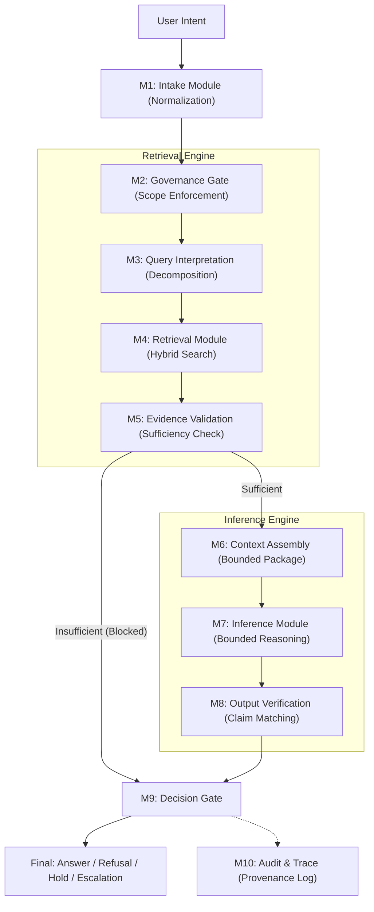

# A-RIF: Accountable Retrieval & Inference Framework

## Canonical System Architecture Specification (v1.0.0)

> [!IMPORTANT]
> **A-RIF** is the official specification for the governed retrieval-inference architecture of **arifOS**. It provides implementation guidelines for minimizing AI hallucinations through accountability mechanisms and defines the constitutional governance layer of the system.

## 0. Theoretical Context

A-RIF executes the logic defined in the [**APEX THEORY**](file:///C:/ariffazil/arifOS/333/333_APEX_CANON.md) framework. While APEX THEORY provides the **Knowledge Container** (Constitutional Principles), A-RIF provides the **Implementation Protocol** (Governance Gates).

## 1. Governance Flow Architecture (Mermaid)

## 2. Core Positioning

- **What A-RIF is**: A governed RAG-class architecture; a judgment-bounded retrieval system; a constraint-first cognitive pipeline.
- **What A-RIF is not**: A plain vector search engine; a standard prompt-stuffing RAG; a purely autonomous agent.
- **Key Formula**: `A-RIF = RAG + Validation + Verification + Decision Governance`.

## 3. Failure State Taxonomy

| Code | Name | Meaning |
| :--- | :--- | :--- |
| **F001** | INPUT_AMBIGUOUS | Query unclear |
| **F002** | POLICY_BLOCKED | Request violates policy |
| **F003** | SOURCE_UNTRUSTED | Evidence source below trust threshold |
| **F004** | GROUNDING_INSUFFICIENT | Not enough support to answer |
| **F005** | CLAIM_UNSUPPORTED | Generated claim not evidenced |
| **F006** | CONTRADICTION_FOUND | Evidence conflict unresolved |
| **F007** | HUMAN_REQUIRED | Decision exceeds machine authority |
| **F008** | TRACE_BROKEN | Missing provenance / audit continuity |
| **F009** | CONTEXT_OVERFLOW | Too much evidence for bounded reasoning |
| **F010** | INTEGRITY_VOID | Trust boundary broken |

## 4. Minimum Viable A-RIF (MVP) Requirements

- **Required Components**: Embedding model, Vector DB, Lexical retriever, Rule engine, LLM, Answer verifier, Audit logger.
- **Critical Boundary**: "No answer without minimum grounding. No unsupported claim release."

## 5. Metadata Mapping: HF Dataset → Qdrant/LanceDB

Based on the `ariffazil/APEX_THEORY` schema, the following mapping is enforced during the batch ingestion job:

| HF Field | A-RIF / Qdrant Property | Transformation / Logic |
| :--- | :--- | :--- |
| `id` | `doc_id` | Preserved as canonical filename/reference |
| `text` | (Vector) + `content` | Embedded via `bge-arifos`; raw text stored in payload |
| `type` | `tags` | Wrapped in list: `["canon"]` or `["theory"]` |
| `amanah_score` | `trust_tier` | `score >= 0.9` → `"high"`, else `"medium"` |
| `governance_floor` | `governance_floor` | Preserved as integer for F-level filtering |
| — | `source` | Hardcoded: `"hf_apex_theory_v0"` |
| — | `chunk_id` | SHA-256 hash of `text` to ensure idempotency |
| — | `version` | Current ingestion timestamp (ISO-8601) |

## 6. Implementation Layer: smolagents

The **AAA Operational Wire** uses [**smolagents**](https://huggingface.co/docs/smolagents) for LLM-driven tool use. The `CodeAgent` serves as the core reasoning engine, executing Python-based tools that implement the A-RIF modules:

- **M4 (Retrieval)**: `retrieve_canonical_evidence` tool.
- **M5 (Validation)**: Agent-led verification of evidence sufficiency.
- **M8 (Verification)**: `verify_claim_alignment` tool to audit generated claims.

## 7. Non-Bypassable Rules

1. No answer without minimum grounding.
2. No unsupported claim release.
3. No authority escalation without explicit human approval.
4. No hidden source substitution.
5. No silent confidence inflation.
