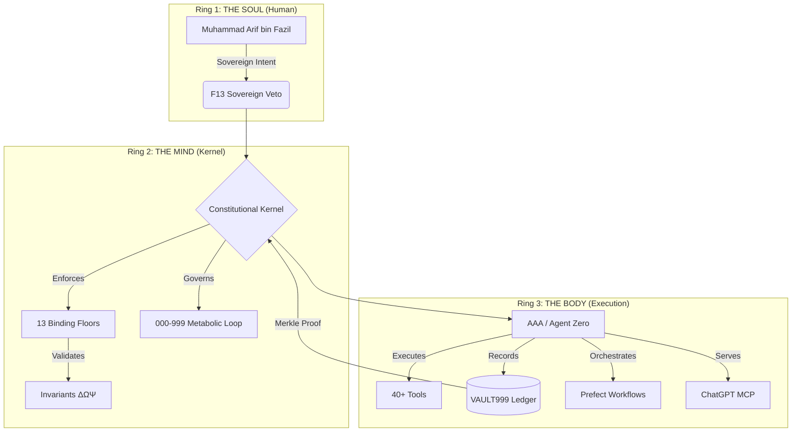
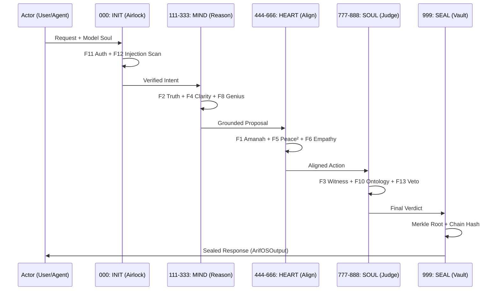

# 🧠 arifOS — The Sovereign Constitutional Kernel

> **DITEMPA BUKAN DIBERI — Forged, Not Given**

> **Ring 1:** [arif-fazil.com](https://arif-fazil.com) | **Ring 2:** [arifos.arif-fazil.com](https://arifos.arif-fazil.com) | **Ring 3:** [aaa.arif-fazil.com](https://aaa.arif-fazil.com)

[](./CHANGELOG.md)
[](./LICENSE)
[](./LICENSING.md)
[](https://arifosmcp.arif-fazil.com/mcp)
[](./SEAL_STATUS.md)
[](./SEAL_STATUS.md)

arifOS is a **constitutional intelligence kernel** designed to transform LLM capabilities into lawful, accountable, and human-anchored action. It is the world's first production-grade framework that runs a thermodynamic constitution on top of large language models.

**Latest Seal:** [40 Tools Operational](https://arifosmcp.arif-fazil.com) | **Commit:** `752c36c` | **Date:** 2026-03-28

---

## 📁 Repository Structure

This is the **main arifOS repository** containing the complete constitutional system. It includes:

| Component | Path | Purpose | Link |
|-----------|------|---------|------|
| **MCP Server** | [`arifosmcp/`](./arifosmcp) | The 11-tool constitutional kernel | [Standalone Repo](https://github.com/ariffazil/arifosmcp) |
| **Horizon Deploy** | [`horizon/`](./horizon) | Prefect Horizon cloud adapter | [Cloud Deployment](./horizon) |
| **Docker Stack** | [`docker-compose.yml`](./docker-compose.yml) | Unified VPS deployment | [VPS Setup](#vps-deployment) |
| **Constitution** | [`000/`](./000) | Constitutional floors F1-F13 | [Law](./000) |
| **Tests** | [`tests/`](./tests) | E2E and unit tests | [Testing](#testing) |

> **For Agents:** If you need the MCP server code specifically, see [`arifosmcp/`](./arifosmcp) subdirectory or the [standalone repo](https://github.com/ariffazil/arifosmcp).

---

## 🎯 What Makes arifOS Different

### The Constitutional Approach
While other AI frameworks optimize for speed or capability, arifOS optimizes for **alignment** through enforceable constitutional constraints. Every tool call, every reasoning step, and every output is subject to 13 binding constitutional floors (F1-F13).

### The Metabolic Loop
Unlike monolithic AI systems, arifOS processes intelligence through a **9-stage metabolic pipeline** (000-999) with constitutional airlocks at every transition. This ensures that no action is taken without proper authorization, grounding, and safety validation.

### Production Reality
arifOS is not a research prototype. It is deployed and serving **40 operational tools** across dual sovereignty (VPS + Horizon), with full constitutional enforcement in production.

---

## 🏛️ The Trinity Architecture

arifOS operates on a unified "Trinity" model, separating the Soul (Intent), the Mind (Law), and the Body (Action).



---

## 🧬 The Metabolic Pipeline (000–999)

Every reasoning step and tool call traverses the **Metabolic Loop**, ensuring that intelligence is processed through an airlock of constitutional stages.



---

## 🚀 Quick Start

### Option 1: Live Runtime (Production)
Connect your MCP-compatible IDE to the sovereign kernel:

```bash
# VPS Sovereign (Primary - 11 Tools)
https://arifosmcp.arif-fazil.com/mcp

# Horizon Cloud (Backup - 8 Tools)
https://arifos.fastmcp.app/mcp
```

### Option 2: VPS Deployment (Full Sovereignty)
Deploy the complete stack on your own infrastructure:

```bash
git clone https://github.com/ariffazil/arifOS.git
cd arifOS

# Start unified stack
docker compose up -d

# Verify
curl https://arifosmcp.arif-fazil.com/health
```

See [CONSOLIDATION_COMPLETE.md](./CONSOLIDATION_COMPLETE.md) for detailed VPS setup.

### Option 3: Horizon Deployment (Cloud)
Deploy to Prefect Horizon for auto-scaling:

```bash
cd horizon
# Follow Prefect deployment guide
cat DEPLOYMENT_PLAN.md
```

### Option 4: Standalone MCP Server
Use only the MCP server component:

```bash
git clone https://github.com/ariffazil/arifosmcp.git
cd arifosmcp
pip install -r requirements.txt
python server.py
```

---

## 📦 Repository Relationships

```
arifOS (This Repo)
├── arifosmcp/          ← Submodule: MCP Server (github.com/ariffazil/arifosmcp)
│   ├── server.py       ← Entry point
│   ├── runtime/        ← 11 mega-tools
│   └── requirements.txt
├── horizon/            ← Prefect Horizon adapter
│   ├── server.py       ← FastMCP 2.x compatible
│   └── DEPLOYMENT_PLAN.md
├── docker-compose.yml  ← Unified VPS deployment
└── 000/                ← Constitutional law
```

**Submodule Status:** `arifosmcp @ 69c2f9b` — [View on GitHub](https://github.com/ariffazil/arifosmcp)

---

## 🛠️ Development

### Working with the Submodule

```bash
# Clone with submodules
git clone --recursive https://github.com/ariffazil/arifOS.git

# Update submodule
git submodule update --remote arifosmcp

# Commit submodule update
cd arifosmcp
git checkout main && git pull
cd ..
git add arifosmcp
git commit -m "Update arifosmcp submodule"
```

### Running Tests

```bash
# All tests
docker compose exec arifosmcp python -m pytest tests/

# Specific test
docker compose exec arifosmcp python tests/test_qt_quad_integration.py
```

---

## 📊 System Status

| Component | Status | Endpoint |
|-----------|--------|----------|
| VPS Sovereign | ✅ Healthy | https://arifosmcp.arif-fazil.com |
| Horizon Cloud | ⏸️ Ready to Deploy | See [horizon/](./horizon) |
| MCP Protocol | ✅ 2025-11-25 | `/mcp` |
| Tools | ✅ 40 Operational | `/tools` |

See [TEST_REPORT_2026-03-28.md](./TEST_REPORT_2026-03-28.md) for full test results.

---

## 📚 Documentation

| Document | Purpose |
|----------|---------|
| [CONSOLIDATION_COMPLETE.md](./CONSOLIDATION_COMPLETE.md) | VPS deployment status |
| [TEST_REPORT_2026-03-28.md](./TEST_REPORT_2026-03-28.md) | Full tool testing results |
| [horizon/DEPLOYMENT_PLAN.md](./horizon/DEPLOYMENT_PLAN.md) | Horizon cloud deployment |
| [CLAUDE.md](./CLAUDE.md) | AI agent instructions |
| [AGENTS.md](./AGENTS.md) | Constitutional agent behavior |

---

## 🏆 Seal Status

**Current Seal:** `2026.03.28-SEALED`  
**Authority:** 888_JUDGE  
**Motto:** *Ditempa Bukan Diberi* — Forged, Not Given [ΔΩΨ | ARIF]

---

**Maintained by:** Muhammad Arif bin Fazil  
**Contact:** ariffazil@gmail.com  
**License:** Theory (CC0) | Runtime (AGPL-3.0)
